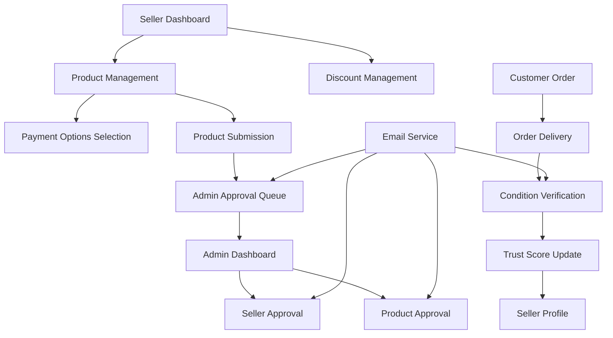
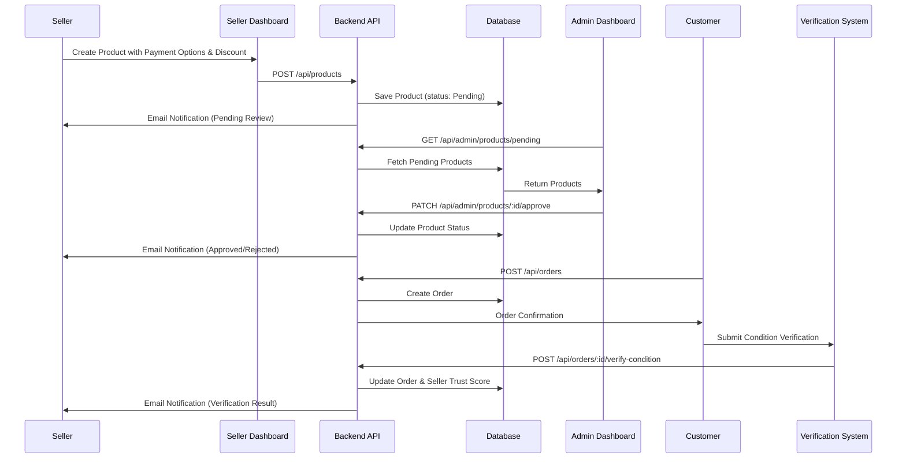

# Design Document: Seller Enhancements

## Overview

This design document outlines the implementation of four critical missing features for the Rebuy seller system: Payment Options System, Discounts and Promotions, Admin Approval Workflow, and Condition Verification System. These enhancements will improve seller capabilities, strengthen trust through verification, and provide administrative control over marketplace quality. The system builds upon the existing seller infrastructure with separate sellers collection, product management, and basic statistics tracking.

## Architecture



## Main Workflow




## Components and Interfaces

### Component 1: Payment Options Manager

**Purpose**: Allow sellers to configure multiple payment methods per product

**Interface**:
```javascript
interface PaymentOptionsManager {
  addPaymentOption(productId: string, option: PaymentOption): Promise<Product>
  removePaymentOption(productId: string, option: PaymentOption): Promise<Product>
  getAvailableOptions(): PaymentOption[]
}

type PaymentOption = 'cod' | 'online' | 'esewa' | 'khalti' | 'card'
```

**Responsibilities**:
- Manage payment method selection for products
- Validate payment option combinations
- Display available payment methods to customers

### Component 2: Discount Manager

**Purpose**: Enable sellers to create and manage promotional pricing

**Interface**:
```javascript
interface DiscountManager {
  createDiscount(productId: string, discount: DiscountConfig): Promise<Product>
  updateDiscount(productId: string, discount: DiscountConfig): Promise<Product>
  removeDiscount(productId: string): Promise<Product>
  calculateDiscountedPrice(originalPrice: number, discount: DiscountConfig): number
  isDiscountActive(discount: DiscountConfig): boolean
}

interface DiscountConfig {
  percentage: number
  startDate: Date
  endDate: Date
  active: boolean
}
```

**Responsibilities**:
- Create and manage discount campaigns
- Calculate discounted prices
- Validate discount dates and percentages
- Display original and discounted prices


### Component 3: Admin Approval System

**Purpose**: Provide administrative control over seller and product approvals

**Interface**:
```javascript
interface AdminApprovalSystem {
  getPendingSellers(): Promise<Seller[]>
  approveSeller(sellerId: string, adminNotes?: string): Promise<Seller>
  rejectSeller(sellerId: string, reason: string): Promise<Seller>
  suspendSeller(sellerId: string, reason: string): Promise<Seller>
  
  getPendingProducts(): Promise<Product[]>
  approveProduct(productId: string, adminNotes?: string): Promise<Product>
  rejectProduct(productId: string, reason: string): Promise<Product>
  
  sendApprovalNotification(email: string, type: 'seller' | 'product', status: string): Promise<void>
}
```

**Responsibilities**:
- Manage seller approval workflow
- Manage product approval workflow
- Send email notifications for status changes
- Track approval history and admin notes

### Component 4: Condition Verification System

**Purpose**: Enable buyers to verify product condition and build seller trust scores

**Interface**:
```javascript
interface ConditionVerificationSystem {
  submitVerification(orderId: string, verification: VerificationData): Promise<Order>
  calculateTrustScore(sellerId: string): Promise<number>
  getSellerVerifications(sellerId: string): Promise<Verification[]>
  handleDispute(orderId: string, disputeData: DisputeData): Promise<Dispute>
}

interface VerificationData {
  matchesDescription: 'yes' | 'no' | 'partially'
  conditionRating: number
  feedback: string
  images?: string[]
}

interface DisputeData {
  reason: string
  evidence: string[]
  requestedResolution: 'refund' | 'replacement' | 'partial_refund'
}
```

**Responsibilities**:
- Collect buyer verification after delivery
- Calculate and update seller trust scores
- Handle condition disputes
- Track verification history


## Data Models

### Model 1: Enhanced Product Schema

```javascript
interface EnhancedProduct {
  // Existing fields
  _id: ObjectId
  name: string
  description: string
  price: number
  category: string
  condition: string
  size: string
  brand: string
  stock: number
  images: string[]
  seller: ObjectId
  sellerName: string
  storeName: string
  story: string
  rating: number
  reviews: number
  sold: number
  featured: boolean
  tags: string[]
  
  // NEW: Payment Options
  paymentOptions: PaymentOption[]
  
  // NEW: Discount Configuration
  discount: {
    percentage: number
    startDate: Date
    endDate: Date
    active: boolean
  }
  
  // NEW: Admin Approval
  status: 'Pending' | 'Approved' | 'Rejected'
  adminNotes: string
  approvedBy: ObjectId
  approvedAt: Date
  rejectionReason: string
  
  timestamps: {
    createdAt: Date
    updatedAt: Date
  }
}
```

**Validation Rules**:
- paymentOptions: Must contain at least one option, maximum 4 options
- discount.percentage: Must be between 0 and 100
- discount.startDate: Must be before endDate
- discount.endDate: Must be in the future for active discounts
- status: Defaults to 'Pending' for new products


### Model 2: Enhanced Seller Schema

```javascript
interface EnhancedSeller {
  // Existing fields
  _id: ObjectId
  fullName: string
  email: string
  password: string
  phone: string
  storeName: string
  storeDescription: string
  address: string
  city: string
  rating: number
  totalSales: number
  totalProducts: number
  
  // ENHANCED: Status with admin workflow
  status: 'pending' | 'approved' | 'rejected' | 'suspended'
  
  // NEW: Trust Score System
  trustScore: {
    score: number
    totalVerifications: number
    positiveVerifications: number
    partialVerifications: number
    negativeVerifications: number
    lastUpdated: Date
  }
  
  // NEW: Admin Approval Data
  approvalData: {
    approvedBy: ObjectId
    approvedAt: Date
    rejectionReason: string
    suspensionReason: string
    adminNotes: string
  }
  
  timestamps: {
    createdAt: Date
    updatedAt: Date
  }
}
```

**Validation Rules**:
- status: Defaults to 'pending' for new sellers
- trustScore.score: Calculated value between 0 and 100
- trustScore.totalVerifications: Sum of all verification types
- email: Must be unique across sellers collection


### Model 3: Enhanced Order Schema

```javascript
interface EnhancedOrder {
  // Existing fields
  _id: ObjectId
  customer: ObjectId
  customerName: string
  customerEmail: string
  customerPhone: string
  items: OrderItem[]
  shippingAddress: Address
  paymentMethod: string
  paymentStatus: string
  transactionId: string
  subtotal: number
  shippingCost: number
  total: number
  status: string
  trackingNumber: string
  estimatedDelivery: Date
  orderDate: Date
  confirmedAt: Date
  shippedAt: Date
  deliveredAt: Date
  cancelledAt: Date
  customerNotes: string
  adminNotes: string
  
  // ENHANCED: Condition Verification
  conditionVerification: {
    verified: boolean
    verifiedAt: Date
    matchesDescription: 'yes' | 'no' | 'partially'
    conditionRating: number
    customerFeedback: string
    verificationImages: string[]
    
    // Dispute handling
    disputeRaised: boolean
    disputeReason: string
    disputeEvidence: string[]
    disputeStatus: 'pending' | 'resolved' | 'rejected'
    disputeResolution: string
    resolvedAt: Date
  }
}
```

**Validation Rules**:
- conditionVerification.verified: Can only be set after order status is 'Delivered'
- conditionVerification.conditionRating: Must be between 1 and 5
- conditionVerification.matchesDescription: Required when verified is true
- disputeRaised: Can only be true if matchesDescription is 'no' or 'partially'


## Algorithmic Pseudocode

### Main Processing Algorithm: Product Creation with Payment Options and Discount

```pascal
ALGORITHM createProductWithEnhancements(productData, sellerId)
INPUT: productData (product details), sellerId (seller identifier)
OUTPUT: result of type ProductCreationResult

BEGIN
  ASSERT sellerId IS NOT NULL
  ASSERT productData.paymentOptions.length >= 1
  
  // Step 1: Validate seller status
  seller ← database.findSeller(sellerId)
  IF seller.status ≠ 'approved' THEN
    RETURN Error("Only approved sellers can create products")
  END IF
  
  // Step 2: Validate payment options
  FOR each option IN productData.paymentOptions DO
    IF option NOT IN ['cod', 'online', 'esewa', 'khalti', 'card'] THEN
      RETURN Error("Invalid payment option: " + option)
    END IF
  END FOR
  
  // Step 3: Validate discount if present
  IF productData.discount IS NOT NULL THEN
    IF productData.discount.percentage < 0 OR productData.discount.percentage > 100 THEN
      RETURN Error("Discount percentage must be between 0 and 100")
    END IF
    
    IF productData.discount.startDate >= productData.discount.endDate THEN
      RETURN Error("Start date must be before end date")
    END IF
  END IF
  
  // Step 4: Create product with Pending status
  product ← NEW Product({
    ...productData,
    seller: sellerId,
    status: 'Pending',
    createdAt: NOW()
  })
  
  database.save(product)
  
  // Step 5: Send notification to admin
  emailService.sendToAdmin({
    subject: "New Product Pending Approval",
    productId: product._id,
    sellerName: seller.fullName
  })
  
  // Step 6: Send notification to seller
  emailService.sendToSeller({
    email: seller.email,
    subject: "Product Submitted for Review",
    productName: product.name
  })
  
  RETURN Success(product)
END
```

**Preconditions**:
- sellerId must reference an existing approved seller
- productData.paymentOptions must contain at least one valid option
- If discount is provided, dates must be valid and percentage in range

**Postconditions**:
- Product is created with status 'Pending'
- Admin receives email notification
- Seller receives confirmation email
- Product is not visible to customers until approved


### Algorithm: Admin Product Approval

```pascal
ALGORITHM approveProduct(productId, adminId, adminNotes)
INPUT: productId (product identifier), adminId (admin identifier), adminNotes (optional notes)
OUTPUT: result of type ApprovalResult

BEGIN
  ASSERT productId IS NOT NULL
  ASSERT adminId IS NOT NULL
  
  // Step 1: Fetch product
  product ← database.findProduct(productId)
  IF product IS NULL THEN
    RETURN Error("Product not found")
  END IF
  
  IF product.status ≠ 'Pending' THEN
    RETURN Error("Product is not pending approval")
  END IF
  
  // Step 2: Update product status
  product.status ← 'Approved'
  product.approvedBy ← adminId
  product.approvedAt ← NOW()
  product.adminNotes ← adminNotes
  
  database.save(product)
  
  // Step 3: Fetch seller information
  seller ← database.findSeller(product.seller)
  
  // Step 4: Send approval notification
  emailService.sendToSeller({
    email: seller.email,
    subject: "Product Approved",
    productName: product.name,
    message: "Your product has been approved and is now live"
  })
  
  RETURN Success(product)
END
```

**Preconditions**:
- productId must reference an existing product
- product.status must be 'Pending'
- adminId must reference a valid admin user

**Postconditions**:
- product.status is 'Approved'
- product.approvedBy and approvedAt are set
- Seller receives email notification
- Product becomes visible to customers


### Algorithm: Seller Approval Workflow

```pascal
ALGORITHM approveSeller(sellerId, adminId, adminNotes)
INPUT: sellerId (seller identifier), adminId (admin identifier), adminNotes (optional notes)
OUTPUT: result of type SellerApprovalResult

BEGIN
  ASSERT sellerId IS NOT NULL
  ASSERT adminId IS NOT NULL
  
  // Step 1: Fetch seller
  seller ← database.findSeller(sellerId)
  IF seller IS NULL THEN
    RETURN Error("Seller not found")
  END IF
  
  IF seller.status ≠ 'pending' THEN
    RETURN Error("Seller is not pending approval")
  END IF
  
  // Step 2: Update seller status
  seller.status ← 'approved'
  seller.approvalData.approvedBy ← adminId
  seller.approvalData.approvedAt ← NOW()
  seller.approvalData.adminNotes ← adminNotes
  
  // Step 3: Initialize trust score
  seller.trustScore ← {
    score: 50,
    totalVerifications: 0,
    positiveVerifications: 0,
    partialVerifications: 0,
    negativeVerifications: 0,
    lastUpdated: NOW()
  }
  
  database.save(seller)
  
  // Step 4: Send approval notification
  emailService.sendToSeller({
    email: seller.email,
    subject: "Seller Account Approved",
    storeName: seller.storeName,
    message: "Congratulations! You can now start listing products"
  })
  
  RETURN Success(seller)
END
```

**Preconditions**:
- sellerId must reference an existing seller
- seller.status must be 'pending'
- adminId must reference a valid admin user

**Postconditions**:
- seller.status is 'approved'
- seller.trustScore is initialized to 50
- Seller receives email notification
- Seller can now create products


### Algorithm: Condition Verification and Trust Score Calculation

```pascal
ALGORITHM submitConditionVerification(orderId, verificationData)
INPUT: orderId (order identifier), verificationData (verification details)
OUTPUT: result of type VerificationResult

BEGIN
  ASSERT orderId IS NOT NULL
  ASSERT verificationData.matchesDescription IN ['yes', 'no', 'partially']
  ASSERT verificationData.conditionRating >= 1 AND verificationData.conditionRating <= 5
  
  // Step 1: Fetch order
  order ← database.findOrder(orderId)
  IF order IS NULL THEN
    RETURN Error("Order not found")
  END IF
  
  IF order.status ≠ 'Delivered' THEN
    RETURN Error("Can only verify delivered orders")
  END IF
  
  IF order.conditionVerification.verified = true THEN
    RETURN Error("Order already verified")
  END IF
  
  // Step 2: Update order verification
  order.conditionVerification ← {
    verified: true,
    verifiedAt: NOW(),
    matchesDescription: verificationData.matchesDescription,
    conditionRating: verificationData.conditionRating,
    customerFeedback: verificationData.feedback,
    verificationImages: verificationData.images
  }
  
  database.save(order)
  
  // Step 3: Update seller trust score for each item
  FOR each item IN order.items DO
    seller ← database.findSeller(item.seller)
    
    // Update verification counts
    seller.trustScore.totalVerifications ← seller.trustScore.totalVerifications + 1
    
    IF verificationData.matchesDescription = 'yes' THEN
      seller.trustScore.positiveVerifications ← seller.trustScore.positiveVerifications + 1
    ELSE IF verificationData.matchesDescription = 'partially' THEN
      seller.trustScore.partialVerifications ← seller.trustScore.partialVerifications + 1
    ELSE
      seller.trustScore.negativeVerifications ← seller.trustScore.negativeVerifications + 1
    END IF
    
    // Calculate new trust score
    positiveWeight ← seller.trustScore.positiveVerifications * 1.0
    partialWeight ← seller.trustScore.partialVerifications * 0.5
    negativeWeight ← seller.trustScore.negativeVerifications * 0.0
    
    totalWeight ← positiveWeight + partialWeight + negativeWeight
    maxWeight ← seller.trustScore.totalVerifications * 1.0
    
    seller.trustScore.score ← (totalWeight / maxWeight) * 100
    seller.trustScore.lastUpdated ← NOW()
    
    database.save(seller)
    
    // Step 4: Send notification to seller
    emailService.sendToSeller({
      email: seller.email,
      subject: "Product Condition Verified",
      orderId: order._id,
      result: verificationData.matchesDescription,
      trustScore: seller.trustScore.score
    })
  END FOR
  
  RETURN Success(order)
END
```

**Preconditions**:
- orderId must reference an existing delivered order
- order must not be already verified
- verificationData.matchesDescription must be valid enum value
- verificationData.conditionRating must be between 1 and 5

**Postconditions**:
- order.conditionVerification.verified is true
- Seller trust score is updated based on verification result
- Seller receives email notification with verification result
- Trust score calculation: (positive * 1.0 + partial * 0.5 + negative * 0.0) / total * 100

**Loop Invariants**:
- All processed items have updated seller trust scores
- Trust score remains between 0 and 100 throughout iteration


### Algorithm: Calculate Discounted Price

```pascal
ALGORITHM calculateDiscountedPrice(product)
INPUT: product (product with discount configuration)
OUTPUT: finalPrice of type number

BEGIN
  ASSERT product IS NOT NULL
  ASSERT product.price > 0
  
  // Step 1: Check if discount exists and is active
  IF product.discount IS NULL OR product.discount.active = false THEN
    RETURN product.price
  END IF
  
  // Step 2: Check if discount is within valid date range
  currentDate ← NOW()
  IF currentDate < product.discount.startDate OR currentDate > product.discount.endDate THEN
    RETURN product.price
  END IF
  
  // Step 3: Calculate discounted price
  discountAmount ← product.price * (product.discount.percentage / 100)
  finalPrice ← product.price - discountAmount
  
  // Step 4: Round to 2 decimal places
  finalPrice ← ROUND(finalPrice, 2)
  
  RETURN finalPrice
END
```

**Preconditions**:
- product must exist and have a valid price > 0
- If discount exists, percentage must be between 0 and 100

**Postconditions**:
- Returns original price if no active discount
- Returns discounted price if discount is active and within date range
- Discounted price is always less than or equal to original price
- Result is rounded to 2 decimal places


## Key Functions with Formal Specifications

### Function 1: validatePaymentOptions()

```javascript
function validatePaymentOptions(options: PaymentOption[]): boolean
```

**Preconditions:**
- `options` is a non-null array
- Array length is between 1 and 4

**Postconditions:**
- Returns `true` if all options are valid payment types
- Returns `false` if any option is invalid or array is empty
- No side effects on input array

**Loop Invariants:**
- All previously checked options are valid when loop continues

### Function 2: isDiscountActive()

```javascript
function isDiscountActive(discount: DiscountConfig): boolean
```

**Preconditions:**
- `discount` object is defined
- `discount.startDate` and `discount.endDate` are valid Date objects
- `discount.active` is a boolean

**Postconditions:**
- Returns `true` if discount is active and current date is within range
- Returns `false` otherwise
- No mutations to discount parameter

### Function 3: calculateTrustScore()

```javascript
function calculateTrustScore(seller: Seller): number
```

**Preconditions:**
- `seller` object exists with trustScore property
- `seller.trustScore.totalVerifications >= 0`
- Sum of positive, partial, and negative verifications equals totalVerifications

**Postconditions:**
- Returns score between 0 and 100
- Score = (positive * 1.0 + partial * 0.5 + negative * 0.0) / total * 100
- Returns 50 (default) if totalVerifications is 0
- No mutations to seller object


### Function 4: sendApprovalEmail()

```javascript
function sendApprovalEmail(
  email: string, 
  type: 'seller' | 'product', 
  status: 'approved' | 'rejected', 
  details: object
): Promise<void>
```

**Preconditions:**
- `email` is a valid email address format
- `type` is either 'seller' or 'product'
- `status` is either 'approved' or 'rejected'
- `details` object contains required fields based on type

**Postconditions:**
- Email is sent to specified address
- Email content matches type and status
- Promise resolves on successful send
- Promise rejects on email service failure

### Function 5: handleDispute()

```javascript
function handleDispute(orderId: string, disputeData: DisputeData): Promise<Dispute>
```

**Preconditions:**
- `orderId` references an existing order
- Order has verified condition with matchesDescription = 'no' or 'partially'
- `disputeData.reason` is non-empty string
- `disputeData.evidence` array contains at least one item

**Postconditions:**
- Dispute record is created in database
- Order.conditionVerification.disputeRaised is set to true
- Admin receives notification email
- Seller receives notification email
- Returns created Dispute object


## Example Usage

### Example 1: Creating Product with Payment Options and Discount

```javascript
// Seller creates product with multiple payment options and promotional discount
const productData = {
  name: "Vintage Leather Jacket",
  description: "Genuine leather jacket in excellent condition",
  price: 8000,
  category: "Men",
  condition: "Like New",
  size: "L",
  brand: "Levi's",
  stock: 3,
  images: ["https://example.com/jacket1.jpg", "https://example.com/jacket2.jpg"],
  story: "Bought in 2020, worn only a few times",
  
  // NEW: Payment options
  paymentOptions: ["cod", "esewa", "khalti"],
  
  // NEW: Promotional discount
  discount: {
    percentage: 15,
    startDate: new Date("2024-03-15"),
    endDate: new Date("2024-03-31"),
    active: true
  },
  
  sellerId: "seller123"
};

const result = await createProduct(productData);
// Product created with status: 'Pending'
// Admin receives email notification
// Seller receives confirmation email
```

### Example 2: Admin Approving Seller

```javascript
// Admin reviews and approves pending seller
const sellerId = "seller456";
const adminId = "admin789";
const adminNotes = "Verified documents and store information";

const result = await approveSeller(sellerId, adminId, adminNotes);
// Seller status: 'pending' → 'approved'
// Trust score initialized to 50
// Seller receives approval email
// Seller can now create products
```


### Example 3: Customer Verifying Product Condition

```javascript
// Customer receives order and verifies condition
const orderId = "order123";
const verificationData = {
  matchesDescription: "yes",
  conditionRating: 5,
  feedback: "Product exactly as described, excellent condition!",
  images: ["https://example.com/received1.jpg"]
};

const result = await submitConditionVerification(orderId, verificationData);
// Order verification marked as complete
// Seller trust score updated: 50 → 100 (if first positive verification)
// Seller receives notification with positive feedback
```

### Example 4: Calculating Discounted Price

```javascript
// Display product with active discount
const product = {
  name: "Vintage T-Shirt",
  price: 2000,
  discount: {
    percentage: 20,
    startDate: new Date("2024-03-01"),
    endDate: new Date("2024-03-31"),
    active: true
  }
};

const originalPrice = product.price; // 2000
const discountedPrice = calculateDiscountedPrice(product); // 1600
const savings = originalPrice - discountedPrice; // 400

// Display to customer:
// Original: Rs. 2000
// Discounted: Rs. 1600 (20% off)
// You save: Rs. 400
```

### Example 5: Admin Rejecting Product

```javascript
// Admin reviews and rejects product
const productId = "product789";
const adminId = "admin123";
const rejectionReason = "Images do not match product description";

const result = await rejectProduct(productId, adminId, rejectionReason);
// Product status: 'Pending' → 'Rejected'
// Seller receives email with rejection reason
// Product not visible to customers
```


## Correctness Properties

### Universal Quantification Statements

**Property 1: Payment Options Validity**
```
∀ product ∈ Products: 
  product.paymentOptions.length ≥ 1 ∧ 
  product.paymentOptions.length ≤ 4 ∧
  (∀ option ∈ product.paymentOptions: 
    option ∈ {'cod', 'online', 'esewa', 'khalti', 'card'})
```
Every product must have at least one and at most four payment options, and all options must be valid payment types.

**Property 2: Discount Validity**
```
∀ product ∈ Products: 
  product.discount ≠ null ⟹ 
    (product.discount.percentage ≥ 0 ∧ 
     product.discount.percentage ≤ 100 ∧
     product.discount.startDate < product.discount.endDate)
```
If a product has a discount, the percentage must be between 0 and 100, and start date must be before end date.

**Property 3: Seller Approval Prerequisite**
```
∀ product ∈ Products: 
  product.status = 'Approved' ⟹ 
    (∃ seller ∈ Sellers: 
      seller._id = product.seller ∧ 
      seller.status = 'approved')
```
A product can only be approved if its seller is also approved.

**Property 4: Trust Score Bounds**
```
∀ seller ∈ Sellers: 
  seller.trustScore.score ≥ 0 ∧ 
  seller.trustScore.score ≤ 100 ∧
  seller.trustScore.totalVerifications = 
    seller.trustScore.positiveVerifications + 
    seller.trustScore.partialVerifications + 
    seller.trustScore.negativeVerifications
```
Trust score must be between 0 and 100, and total verifications must equal the sum of all verification types.

**Property 5: Verification Timing**
```
∀ order ∈ Orders: 
  order.conditionVerification.verified = true ⟹ 
    (order.status = 'Delivered' ∧ 
     order.conditionVerification.verifiedAt ≥ order.deliveredAt)
```
Orders can only be verified after delivery, and verification timestamp must be after delivery timestamp.

**Property 6: Discount Price Reduction**
```
∀ product ∈ Products: 
  isDiscountActive(product.discount) ⟹ 
    calculateDiscountedPrice(product) < product.price
```
When a discount is active, the discounted price must be less than the original price.

**Property 7: Admin Action Traceability**
```
∀ product ∈ Products: 
  product.status ∈ {'Approved', 'Rejected'} ⟹ 
    (product.approvedBy ≠ null ∧ 
     product.approvedAt ≠ null)
```
All approved or rejected products must have admin traceability (who and when).

**Property 8: Dispute Prerequisite**
```
∀ order ∈ Orders: 
  order.conditionVerification.disputeRaised = true ⟹ 
    (order.conditionVerification.verified = true ∧ 
     order.conditionVerification.matchesDescription ∈ {'no', 'partially'})
```
Disputes can only be raised on verified orders where condition doesn't fully match description.


## Error Handling

### Error Scenario 1: Unapproved Seller Creating Product

**Condition**: Seller with status 'pending', 'rejected', or 'suspended' attempts to create product
**Response**: Return 403 Forbidden with message "Only approved sellers can create products"
**Recovery**: Seller must wait for admin approval or contact support

### Error Scenario 2: Invalid Payment Options

**Condition**: Product submitted with empty paymentOptions array or invalid option types
**Response**: Return 400 Bad Request with message "At least one valid payment option required"
**Recovery**: Seller must select at least one valid payment option from the allowed list

### Error Scenario 3: Invalid Discount Configuration

**Condition**: Discount percentage outside 0-100 range or end date before start date
**Response**: Return 400 Bad Request with specific validation error message
**Recovery**: Seller must correct discount configuration before resubmitting

### Error Scenario 4: Premature Condition Verification

**Condition**: Customer attempts to verify condition before order is delivered
**Response**: Return 400 Bad Request with message "Can only verify delivered orders"
**Recovery**: Customer must wait until order status is 'Delivered'

### Error Scenario 5: Duplicate Verification

**Condition**: Customer attempts to verify an already verified order
**Response**: Return 400 Bad Request with message "Order already verified"
**Recovery**: Customer can raise a dispute if needed, but cannot re-verify

### Error Scenario 6: Admin Approving Non-Pending Item

**Condition**: Admin attempts to approve product/seller that is not in 'Pending' status
**Response**: Return 400 Bad Request with message "Item is not pending approval"
**Recovery**: Admin should check current status and take appropriate action

### Error Scenario 7: Email Service Failure

**Condition**: Email notification fails to send during approval/verification process
**Response**: Log error, continue with database updates, retry email in background
**Recovery**: System should not block operations due to email failures; implement retry queue

### Error Scenario 8: Trust Score Calculation Error

**Condition**: Verification counts don't sum to total or result in invalid score
**Response**: Log error, set trust score to default (50), notify admin
**Recovery**: Admin can manually review and correct seller trust score


## Testing Strategy

### Unit Testing Approach

Test individual functions and components in isolation with comprehensive coverage of edge cases and error conditions.

**Key Test Cases**:

1. **Payment Options Validation**
   - Valid single option
   - Valid multiple options (2, 3, 4)
   - Invalid: empty array
   - Invalid: more than 4 options
   - Invalid: unknown payment type
   - Invalid: duplicate options

2. **Discount Calculation**
   - Active discount within date range
   - Inactive discount (active = false)
   - Discount before start date
   - Discount after end date
   - Edge case: 0% discount
   - Edge case: 100% discount
   - Rounding to 2 decimal places

3. **Trust Score Calculation**
   - New seller (no verifications) → 50
   - All positive verifications → 100
   - All negative verifications → 0
   - Mixed verifications → weighted average
   - Partial verifications → 0.5 weight
   - Edge case: single verification
   - Edge case: 1000+ verifications

4. **Approval Workflow**
   - Approve pending seller
   - Reject pending seller
   - Suspend approved seller
   - Approve pending product
   - Reject pending product
   - Error: approve already approved
   - Error: approve non-existent item

5. **Condition Verification**
   - Verify delivered order (yes)
   - Verify delivered order (partially)
   - Verify delivered order (no)
   - Error: verify non-delivered order
   - Error: verify already verified order
   - Trust score update after verification


### Property-Based Testing Approach

Use property-based testing to verify invariants hold across wide range of inputs.

**Property Test Library**: fast-check (for JavaScript/Node.js)

**Property Tests**:

1. **Payment Options Array Properties**
   ```javascript
   // Property: All valid payment option arrays have length between 1 and 4
   fc.assert(
     fc.property(
       fc.array(fc.constantFrom('cod', 'online', 'esewa', 'khalti', 'card'), {minLength: 1, maxLength: 4}),
       (options) => validatePaymentOptions(options) === true
     )
   );
   ```

2. **Discount Price Properties**
   ```javascript
   // Property: Discounted price is always less than or equal to original price
   fc.assert(
     fc.property(
       fc.record({
         price: fc.integer({min: 100, max: 100000}),
         discount: fc.record({
           percentage: fc.integer({min: 0, max: 100}),
           active: fc.boolean(),
           startDate: fc.date(),
           endDate: fc.date()
         })
       }),
       (product) => {
         const discounted = calculateDiscountedPrice(product);
         return discounted <= product.price;
       }
     )
   );
   ```

3. **Trust Score Bounds Properties**
   ```javascript
   // Property: Trust score always between 0 and 100
   fc.assert(
     fc.property(
       fc.record({
         positiveVerifications: fc.nat(1000),
         partialVerifications: fc.nat(1000),
         negativeVerifications: fc.nat(1000)
       }),
       (verifications) => {
         const score = calculateTrustScore(verifications);
         return score >= 0 && score <= 100;
       }
     )
   );
   ```

4. **Verification Count Consistency**
   ```javascript
   // Property: Total verifications equals sum of all types
   fc.assert(
     fc.property(
       fc.record({
         positiveVerifications: fc.nat(100),
         partialVerifications: fc.nat(100),
         negativeVerifications: fc.nat(100)
       }),
       (data) => {
         const total = data.positiveVerifications + data.partialVerifications + data.negativeVerifications;
         const trustScore = {
           ...data,
           totalVerifications: total
         };
         return trustScore.totalVerifications === total;
       }
     )
   );
   ```


### Integration Testing Approach

Test complete workflows across multiple components and database interactions.

**Integration Test Scenarios**:

1. **Complete Product Creation Flow**
   - Approved seller creates product with payment options and discount
   - Verify product saved with status 'Pending'
   - Verify admin email sent
   - Verify seller confirmation email sent
   - Admin approves product
   - Verify product status changed to 'Approved'
   - Verify seller approval email sent
   - Verify product visible in customer search

2. **Seller Approval Workflow**
   - New seller registers (status: 'pending')
   - Admin fetches pending sellers list
   - Admin approves seller
   - Verify seller status changed to 'approved'
   - Verify trust score initialized to 50
   - Verify approval email sent
   - Seller creates first product
   - Verify product creation succeeds

3. **Condition Verification Flow**
   - Customer places order
   - Order status progresses: Processing → Confirmed → Shipped → Delivered
   - Customer submits condition verification (positive)
   - Verify order verification marked complete
   - Verify seller trust score updated
   - Verify seller notification email sent
   - Fetch seller profile
   - Verify trust score displayed correctly

4. **Discount Application Flow**
   - Seller creates product with 20% discount
   - Customer views product page
   - Verify discounted price displayed correctly
   - Verify original price shown with strikethrough
   - Customer adds to cart
   - Verify cart shows discounted price
   - Customer completes checkout
   - Verify order total uses discounted price

5. **Dispute Resolution Flow**
   - Customer receives order
   - Customer verifies condition as 'no' (doesn't match)
   - Customer raises dispute with evidence
   - Verify dispute created in database
   - Verify admin notification sent
   - Verify seller notification sent
   - Admin reviews dispute
   - Admin resolves dispute
   - Verify resolution email sent to customer and seller


## Performance Considerations

### Database Indexing

**Required Indexes**:
- `Product.status` - For filtering pending/approved/rejected products
- `Product.seller` - For fetching seller's products
- `Product.discount.endDate` - For querying active discounts
- `Seller.status` - For filtering pending/approved sellers
- `Seller.trustScore.score` - For sorting sellers by trust score
- `Order.conditionVerification.verified` - For finding unverified orders
- `Order.customer` - For fetching customer's orders

**Compound Indexes**:
- `{seller: 1, status: 1}` - For seller's products by status
- `{status: 1, createdAt: -1}` - For admin approval queue (newest first)

### Caching Strategy

**Cache Candidates**:
- Seller trust scores (TTL: 1 hour, invalidate on verification)
- Active discounts list (TTL: 15 minutes)
- Approved products count per seller (TTL: 5 minutes)
- Admin pending items count (TTL: 1 minute)

**Cache Implementation**:
- Use Redis for distributed caching
- Implement cache-aside pattern
- Set appropriate TTLs based on data volatility

### Query Optimization

**Optimization Strategies**:
- Use projection to fetch only required fields
- Implement pagination for admin approval lists (20 items per page)
- Batch email notifications instead of sending individually
- Use aggregation pipeline for trust score calculations
- Lazy load product images on seller dashboard

### Email Service Performance

**Optimization Strategies**:
- Use background job queue (Bull/BullMQ) for email sending
- Batch notifications for multiple products/sellers
- Implement retry mechanism with exponential backoff
- Use email templates to reduce processing time
- Monitor email service rate limits


## Security Considerations

### Authentication and Authorization

**Security Measures**:
- Only approved sellers can create products
- Only admins can approve/reject sellers and products
- Sellers can only edit/delete their own products
- Customers can only verify their own orders
- JWT token validation on all protected routes
- Role-based access control (RBAC) for admin functions

### Input Validation

**Validation Rules**:
- Sanitize all user inputs to prevent XSS attacks
- Validate payment options against whitelist
- Validate discount percentage range (0-100)
- Validate date formats and ranges
- Validate email addresses before sending
- Limit file upload sizes for verification images
- Validate image URLs to prevent SSRF attacks

### Data Protection

**Protection Strategies**:
- Hash sensitive data (passwords) using bcrypt
- Encrypt email content containing sensitive information
- Implement rate limiting on approval endpoints
- Log all admin actions for audit trail
- Mask sensitive data in logs
- Implement CSRF protection on state-changing operations


### Fraud Prevention

**Prevention Measures**:
- Monitor for suspicious discount patterns (e.g., 99% discounts)
- Track seller approval/rejection patterns
- Flag sellers with consistently low trust scores
- Implement cooldown period for re-verification attempts
- Monitor for fake verification submissions
- Track dispute patterns to identify problematic sellers
- Implement IP-based rate limiting for verification submissions

### Email Security

**Security Measures**:
- Use authenticated SMTP connection (TLS/SSL)
- Validate email addresses before sending
- Implement SPF, DKIM, and DMARC records
- Rate limit email sending per seller/customer
- Use email templates to prevent injection attacks
- Log all email sending attempts for audit

## Dependencies

### Backend Dependencies

**Required NPM Packages**:
- `express` (^4.18.0) - Web framework
- `mongoose` (^7.0.0) - MongoDB ODM
- `nodemailer` (^6.9.0) - Email sending
- `bull` (^4.10.0) - Job queue for background tasks
- `redis` (^4.6.0) - Caching layer
- `jsonwebtoken` (^9.0.0) - JWT authentication
- `bcryptjs` (^2.4.3) - Password hashing
- `express-validator` (^7.0.0) - Input validation
- `express-rate-limit` (^6.7.0) - Rate limiting
- `helmet` (^7.0.0) - Security headers

### Frontend Dependencies

**Required NPM Packages**:
- `react` (^18.2.0) - UI framework
- `react-router-dom` (^6.10.0) - Routing
- `axios` (^1.4.0) - HTTP client
- `react-icons` (^4.8.0) - Icon library
- `date-fns` (^2.30.0) - Date formatting
- `react-toastify` (^9.1.0) - Notifications

### External Services

**Required Services**:
- MongoDB (^6.0) - Database
- Redis (^7.0) - Caching and job queue
- SMTP Server - Email delivery (e.g., SendGrid, AWS SES, Gmail)
- Cloudinary (optional) - Image hosting for verification images

